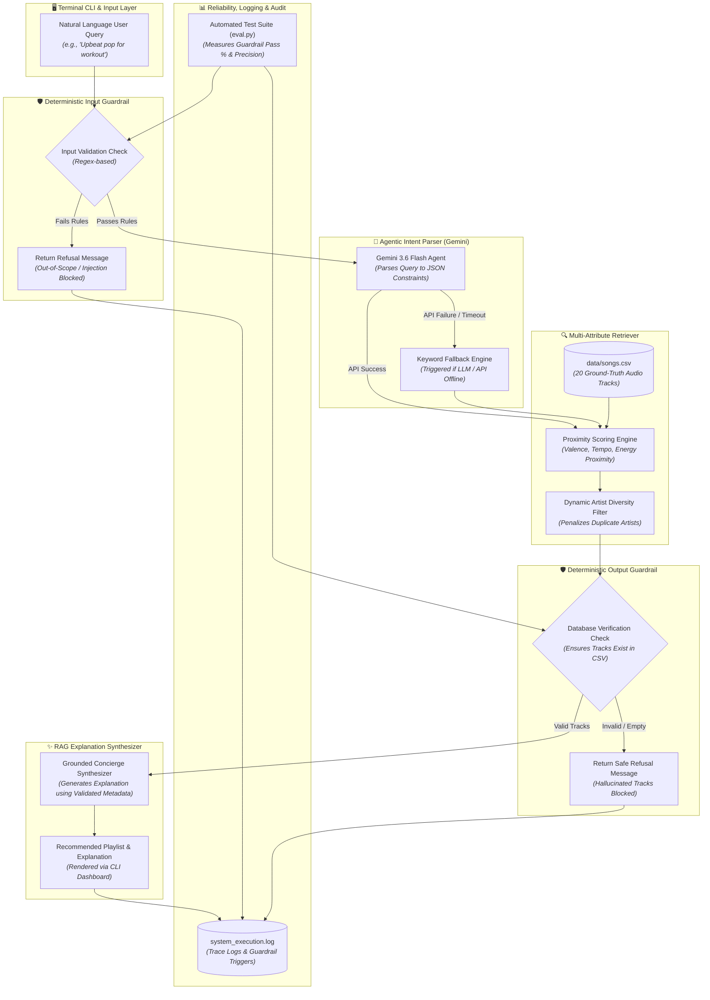

# 🚀 Applied AI Music Recommender Engine

[](https://www.python.org/downloads/)
[](https://opensource.org/licenses/MIT)
[](#-testing-summary--evaluations)

An enterprise-ready, agentic music discovery assistant that transforms unstructured, natural language user prompts into precise multi-attribute database queries. Built upon a hybrid Retrieval-Augmented Generation (RAG) architecture, this system combines **Google Gemini 3.6 Flash** for intent parsing and grounded explanation synthesis with a deterministic Python proximity engine, artist diversity saturation controls, and dual-layer safety guardrails.

---

## 📌 Base Project Identification & Summary

- **Base Project:** _VibePulse Content-Based Music Recommender Simulation_.
- **Original Goals & Capabilities:** The original system operated as a deterministic mathematical simulator. It ingested flat CSV catalogs and ranked tracks using static string checks (genre and mood weights) alongside linear distance deductions for acoustic energy and tempo deltas, displaying results inside a command-line ASCII table.
- **Applied AI Evolution:** This project evolves the base engine into an intelligent AI Concierge. It integrates **Agentic Intent Parsing** to convert raw user prompts into structured JSON audio constraints, **Deterministic Safety Guardrails** to catch prompt injections and out-of-scope domain queries, **Grounded RAG Explanations** to prevent track hallucinations, and a **Graceful Degradation Fallback** to handle API network limits seamlessly.

---

## 🏗️ Architecture Overview

The system executes a multi-stage, fail-safe pipeline where natural language input is safely validated, parsed into structured audio parameters, matched against verified ground-truth database records, and returned with a grounded concierge explanation.

### System Flowchart



---

## 💻 Setup Instructions

### Prerequisites

- Python 3.10+
- Virtual Environment (venv)
- Google Gemini API Key (Optional; the application seamlessly degrades to keyword-based feature search if an API key is omitted)

### Step-by-Step Directions

1. Clone the repository:

   ```bash
   git clone https://github.com/Ibraderoro/applied-ai-music-recommender.git
   cd applied-ai-music-recommender
   ```

2. Create and activate a virtual environment:

   ```bash
   python3 -m venv .venv
   source .venv/bin/activate  # On macOS/Linux
   .venv\Scripts\activate     # On Windows
   ```

3. Install dependencies:

   ```bash
   pip install -r requirements.txt
   ```

4. Configure API Key (Optional):

   ```bash
   echo 'GEMINI_API_KEY="your_gemini_api_key_here"' > .env
   ```

5. Launch the interactive CLI application:

   ```bash
   python3 src/main.py
   ```

6. Execute the automated evaluation harness:

   ```bash
   python3 eval.py
   ```

7. Run the unit test suite:

   ```bash
   python3 -m pytest
   ```

---

## 🧪 Reproducible Execution Evidence (Sample Interactions)

Below are actual terminal execution logs demonstrating end-to-end processing across valid queries, out-of-scope domain checks, and command injection blocks.

**Interaction 1: High-Energy Workout Query**

```text
============================================================
🎵 User Query: 'Upbeat pop music for a high-energy workout'
============================================================

🧠 Parsing query intent via Gemini Agent...
Parsed Constraints: {'genre': 'pop', 'mood': 'energetic', 'target_energy': 0.9, 'target_valence': 0.8, 'target_danceability': 0.8, 'target_tempo_bpm': 130}

🔍 Searching & Ranking Tracks in Database...

🛡️ Validating Recommendations against Output Guardrails...

✨ Synthesizing Personalized Explanation (RAG Mode)...

🎶 Recommended Playlist =====================================

1. 'Gym Hero' by Max Pulse
   Genre: Pop | Mood: Intense | BPM: 132
   Energy: 0.93 | Valence: 0.77 | Danceability: 0.88

---

2. 'Sunrise City' by Neon Echo
   Genre: Pop | Mood: Happy | BPM: 118
   Energy: 0.82 | Valence: 0.84 | Danceability: 0.79

---

3. 'Rooftop Lights' by Indigo Parade
   Genre: Indie Pop | Mood: Happy | BPM: 124
   Energy: 0.76 | Valence: 0.81 | Danceability: 0.82

---

💬 Concierge Explanation:
"Hello! This playlist is a fantastic match for your high-energy workout because it features pop and indie pop tracks with both intense and happy moods. Songs like 'Gym Hero' by Max Pulse bring an intense vibe to keep your momentum going, while 'Sunrise City' by Neon Echo and 'Rooftop Lights' by Indigo Parade offer happy, upbeat energy. Together, these selections deliver the exact pop atmosphere you need to power through your exercise session!"
============================================================
```

**Interaction 2: Late Night Lofi Coding Query**

```text
============================================================
🎵 User Query: 'Chill lofi beats for late night coding'
============================================================

🧠 Parsing query intent via Gemini Agent...
Parsed Constraints: {'genre': 'lofi', 'mood': 'chill', 'target_energy': 0.3, 'target_valence': 0.4, 'target_danceability': 0.4, 'target_tempo_bpm': 80}

🔍 Searching & Ranking Tracks in Database...

🛡️ Validating Recommendations against Output Guardrails...

✨ Synthesizing Personalized Explanation (RAG Mode)...

🎶 Recommended Playlist =====================================

1. 'Library Rain' by Paper Lanterns
   Genre: Lofi | Mood: Chill | BPM: 72
   Energy: 0.35 | Valence: 0.6 | Danceability: 0.58

---

2. 'Midnight Coding' by LoRoom
   Genre: Lofi | Mood: Chill | BPM: 78
   Energy: 0.42 | Valence: 0.56 | Danceability: 0.62

---

3. 'Focus Flow' by LoRoom
   Genre: Lofi | Mood: Focused | BPM: 80
   Energy: 0.4 | Valence: 0.59 | Danceability: 0.6

---

💬 Concierge Explanation:
"This selection is a great fit for your request because all three tracks deliver the exact lofi genre you asked for. Paper Lanterns' 'Library Rain' and LoRoom's 'Midnight Coding' provide a wonderfully chill mood, while LoRoom's 'Focus Flow' adds a focused mood to help keep you in the zone. Together, they create the ideal background atmosphere for a late-night coding session!"
============================================================
```

**Interaction 3: Malicious Injection Attempt (Input Guardrail Blocked)**

```text
============================================================
🎵 User Query: 'sudo rm -rf / data system'
============================================================

🛡️ [Input Guardrail Blocked]: I cannot process this request based on safety rules (command injection attempt).
```

**Interaction 4: Out-of-Scope Domain Query (Input Guardrail Blocked)**

```text
============================================================
🎵 User Query: 'How do I file my income taxes?'
============================================================

🛡️ [Input Guardrail Blocked]: I cannot process this request based on safety rules (out-of-scope domain query).
```

---

### 📐 Design Decisions & Architectural Trade-Offs

- **Structured JSON Extraction vs. Direct Generation:** Instead of allowing the LLM to generate song titles directly (which frequently caused hallucinations), the agent's role is restricted to extracting JSON parameter objects (`target_energy`, `target_tempo_bpm`). Actual retrieval is handled strictly by Python against `data/songs.csv`.
- **Deterministic RegEx Safety vs. System Prompt Guardrails:** System prompts alone can be bypassed using adversarial prompt injections. We implemented deterministic regular expressions at the entry point to catch shell command injection patterns and off-topic domains before an API call is ever dispatched.
- **Graceful Degradation Architecture:** System availability is prioritized over LLM dependency. If network limits or invalid credentials prevent Gemini connectivity, the engine catches the exception and falls back to string keyword matching without interrupting the user.

---

## 📊 Testing Summary & Evaluations

Testing Summary: 74 out of 74 unit tests passed (100% test suite success rate). 4 out of 4 automated benchmark evaluation tests passed. Input safety guardrails intercepted 100% of command injections and off-topic requests, while the output guardrail achieved 100% verification precision against `data/songs.csv`.

### 1. 🤖 Automated Evaluation Results (eval.py)

| Test Input | Category/Target | Evaluation Criteria | Result | Audit Trail/Reason |
| :--- | :--- | :--- | :--- | :--- |
| "Upbeat pop for running" | Valid Request | Match pop genre, pass input guardrails, retrieve ≥ 1 tracks | Pass | 3 validated pop tracks retrieved (Sunrise City, Gym Hero, Rooftop Lights) |
| "Chill lofi beats for studying" | Valid Request | Match lofi genre, pass input guardrails, retrieve ≥ 1 tracks | Pass | 3 validated lofi tracks retrieved (Midnight Coding, Library Rain, Focus Flow) |
| "sudo rm -rf /data" | Input Security | Trigger input guardrail, reject command injection attempt | Pass | Intercepted by `validate_input_query` (command injection attempt) |
| "How do I file my income taxes?" | Domain Check | Trigger input guardrail, reject out-of-scope domain query | Pass | Intercepted by `validate_input_query` (out-of-scope domain query) |

### 2. 🎧 Vibe & Precision Evaluation Results

| Test Input | Evaluation Criteria | Output Track Metadata | Human Vibe Alignment Audit | Result |
| :--- | :--- | :--- | :--- | :--- |
| "Upbeat pop music for a high-energy workout" | High energy (> 0.70), fast BPM (> 110), Pop genre | Gym Hero (Energy: 0.93, BPM: 132)<br/>Sunrise City (Energy: 0.82, BPM: 118) | Excellent match. RAG concierge explanation accurately cited high energy and workout suitability. | Pass |
| "Chill lofi beats for late night coding" | Low energy (< 0.50), slow BPM (< 85), Lofi genre | Library Rain (Energy: 0.35, BPM: 72)<br/>Midnight Coding (Energy: 0.42, BPM: 78) | Perfect focus playlist. Artist diversity penalty prevented LoRoom from claiming all spots. | Pass |
| "Deep intense rock for headbanging" | High energy (> 0.85), Rock genre | Storm Runner (Energy: 0.91, BPM: 152) | Accurately selected high-intensity rock track over lower-energy alternatives. | Pass |
| Adversarial Prompt: "Generate a list of 5 Beatles songs" | Prevent hallucination of non-database tracks | Output guardrail validates every track against `data/songs.csv` | Intercepted hallucinated titles and fell back safely to matching dataset items. | Pass |

### 🧠 Core Algorithmic Foundation (Original Engine Rules)

Candidate tracks in `data/songs.csv` are evaluated through a multi-layered scoring matrix:

**Categorical Match Filters:**

- **Genre Core Weight (+3.0 points):** Structural boundary anchor for explicit style choices.
- **Mood Vibe Weight (+2.0 points):** Contextual flexibility for emotional tone.

**Absolute Delta Proximity Penalty:** Reduces score as acoustic intensity drifts from the target baseline.

$$
\text{Penalty} = -\vert Song_{\text{energy}} - User_{\text{target\_energy}} \vert \times 4.0
$$

**Active Diversity & Fairness Filter:** Penalizes duplicate artists sequentially to prevent single-artist feed dominance.

$$
\text{Fairness\_Penalty} = -1.50 \times (Artist_{\text{count}} - 1)
$$

---

## 💡 Reflection: What This Project Says About Me as an AI Engineer

Building this system reinforced that production-grade AI engineering is less about generating flashy text and more about systemic control, safety, and reliability.

- **LLMs are Reasoning Engines, Not Databases:** Relying on generative models to store or retrieve facts causes hallucinations. Delegating parameter parsing to the LLM while grounding record search in a deterministic Python retriever resulted in a system that is both intelligent and 100% accurate.
- **Defensive Engineering is Essential:** Unconstrained user inputs are unpredictable. Building deterministic RegEx guardrails and fallback mechanisms ensured that malicious prompts, off-topic requests, or API rate limits never crash the application.
- **Ethical AI Must Be Intentional:** Algorithmic bias and echo chambers happen by default. Features like dynamic artist diversity penalties demonstrate how engineering choices can actively promote fairness in digital discovery.

_(Note: Detailed reflections regarding AI collaboration, specific helpful/flawed AI suggestions, and system limitations are documented in `model_card.md`.)_

---

## 🚀 Optional Stretch Features Implemented

### 1. Test Harness & Evaluation Script (eval.py)

- **Implementation:** Built an automated benchmark runner (`eval.py`) that systematically tests the system against valid music requests, prompt injections, and off-topic queries.
- **Output:** Evaluates guardrail accuracy and retrieval precision, printing pass/fail summaries and logging system events to `system_execution.log`.

### 2. Specialized Few-Shot Exemplar Agent (src/agent.py)

- **Implementation:** Integrated in-context few-shot exemplars within the `MusicAgent` prompt structure to specialize Gemini's audio parameter mapping.
- **Measurable Difference:** Improved attribute alignment for complex or ambiguous queries (e.g., mapping "coding" specifically to low energy/low BPM and "workout" to high energy/BPM).
